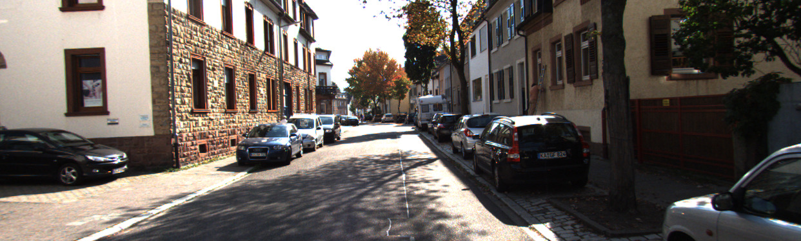
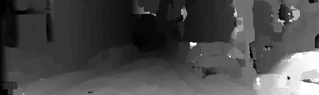

# StereoMatching for depth using CUDA

An implementation of the stereo block matching algorithm using CUDA and C++.
The code includes a CPU multithreaded implementation and GPU implementation to compare performance.

The left to right image disparity is calculated. The left and right images are rectified images.
Images from the KITTI dataset were used.

GPU Time is extremely fast compared to the multithreaded CPU equivalent. Results can be seen below.
This speedup could be exaggerated due to mismatch is hardware age and generation.

Hardware:

CPU: Intel i5-4590
, GPU: GeForce GTX 1660 SUPER

## Examples
| Left Image | Disparity Image (50% scaling) (Window Size - 17) | CPU Time | GPU Time |
| ------------- | ------------- | ------------- | ------------- |
|   |   | 67039.4 ms | 8.65485 ms |
